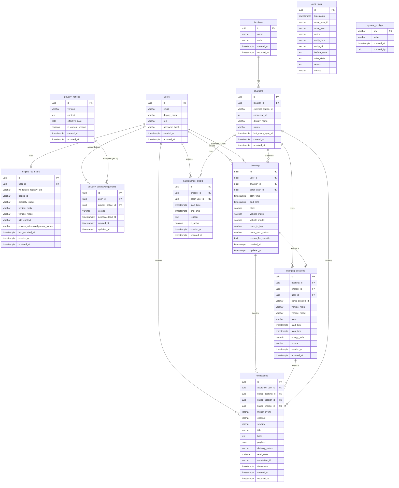

# Data Model — AI-Powered EV Charging Orchestration Platform

**Status:** Authoritative for hackathon MVP
**Date:** 2026-05-22
**Author:** Solution Architect Agent
**Sources:** `functional-requirements.md`, `user-journeys.md`, `solution-architecture.md`, `CLAUDE.md`
**Stack:** ASP.NET Core Web API / Entity Framework Core 8 / Npgsql / PostgreSQL 16

---

## 1. Overview

### Scope

This document defines the complete relational data model for the EV Charging Orchestration Platform MVP. It covers all entities required for the P0 demo spine (booking, CSMS integration, dashboard, privacy, auth, audit) and all P1 extensions (notifications, reporting, maintenance blocks, eligible-user CRUD). P2 entities (AI insights) reuse existing tables and require no additional tables; they are called out where relevant.

| Priority | Scope |
|---|---|
| P0 (Must — done by hour 8) | `locations`, `chargers`, `users`, `eligible_ev_users`, `privacy_notices`, `privacy_acknowledgements`, `bookings`, `charging_sessions`, `audit_logs`, `system_configs` |
| P1 (Should — done by hour 13) | `notifications`, `maintenance_blocks` — plus indexes, additional booking/session fields, and notification cross-channel tracking |
| P2 (Could — hour 14+) | No new tables; the AI layer queries existing `bookings`, `charging_sessions`, and `notifications` tables via `ReportingService` |

### Conventions

| Convention | Rule |
|---|---|
| Naming | `snake_case` for all table and column names (enforced via `UseSnakeCaseNamingConvention()` EFCore.NamingConventions NuGet) |
| Primary keys | `uuid` generated by `gen_random_uuid()` on the database side, set in EF Core as `HasDefaultValueSql("gen_random_uuid()")` |
| Timestamps | All timestamp columns use `timestamptz` (timestamp with time zone). All values stored and compared in UTC. Frontend displays in UTC+4 (Mauritius) using `toLocaleString()`. EF Core configured with `UseTimestamptz()` on the Npgsql provider |
| Enum storage | Stored as `varchar(50)` strings via `HasConversion<string>()` in EF Core. Enum values are PascalCase strings matching C# enum member names |
| Soft-delete | Not used globally. Bookings and sessions use an explicit state enum to mark terminal states (Cancelled, Released, NoShow, Completed, Overridden). Eligible EV Users use `eligibility_status = 'Inactive'` or `'Suspended'` instead of a delete flag. Hard deletes are only used for test/seed cleanup |
| Audit columns | Every table (except `audit_logs` and `system_configs`) carries `created_at timestamptz NOT NULL DEFAULT now()` and `updated_at timestamptz NOT NULL DEFAULT now()`. `audit_logs` is append-only and only has `timestamp`. `system_configs` carries `updated_at` only |
| JSONB | Used for `notifications.payload` (email payload and Teams Adaptive Card JSON). Mapped via `HasColumnType("jsonb")` in EF Core |
| Foreign keys | Declared with explicit ON DELETE / ON UPDATE behaviour per relationship. Default is `RESTRICT` to avoid accidental cascades |

---

## 2. Entity Relationship Summary

```
locations (P0)
  |-- one-to-many --> chargers (P0)

users (P0)
  |-- one-to-one --> eligible_ev_users (P0)
  |-- one-to-many --> bookings (P0)
  |-- one-to-many --> privacy_acknowledgements (P0)
  |-- one-to-many --> notifications [as audience_user_id] (P1)
  |-- one-to-many --> bookings [as actor_user_id] (P0, nullable)
  |-- one-to-many --> maintenance_blocks [as actor_user_id] (P1)

privacy_notices (P0)
  |-- one-to-many --> privacy_acknowledgements (P0)

chargers (P0)
  |-- many-to-one --> locations (P0)
  |-- one-to-many --> bookings (P0)
  |-- one-to-many --> maintenance_blocks (P1)
  |-- one-to-many --> charging_sessions (P0)
  |-- one-to-many --> notifications [as linked_charger_id] (P1, nullable)

bookings (P0)
  |-- many-to-one --> users [as user_id] (P0)
  |-- many-to-one --> chargers (P0)
  |-- many-to-one --> users [as actor_user_id] (P0, nullable)
  |-- one-to-one --> charging_sessions (P0)
  |-- one-to-many --> notifications [as linked_booking_id] (P1, nullable)

charging_sessions (P0)
  |-- one-to-one --> bookings (P0)
  |-- many-to-one --> chargers (P0)
  |-- many-to-one --> users (P0)
  |-- one-to-many --> notifications [as linked_session_id] (P1, nullable)

maintenance_blocks (P1)
  |-- many-to-one --> chargers (P0)
  |-- many-to-one --> users [as actor_user_id] (P0)

notifications (P1)
  |-- many-to-one --> users [as audience_user_id] (P0)
  |-- many-to-one --> bookings [as linked_booking_id] (P0, nullable)
  |-- many-to-one --> charging_sessions [as linked_session_id] (P0, nullable)
  |-- many-to-one --> chargers [as linked_charger_id] (P0, nullable)

audit_logs (P0) -- no FK navigation; entity IDs stored as text strings

system_configs (P0) -- no FK navigation; key/value store
```

### Mermaid ER Diagram



---

## 3. Entities / Tables

### 3.1 `locations` (P0)

**Purpose:** Reference table for the two physical charging sites (NEX Tower and NEXTERACOM). Used to filter chargers, bookings, and reporting by location.

**Owning feature:** FR-BOOK-001, FR-DASH-002 (Slot Booking, Real-Time Availability Dashboard)

| Column | PostgreSQL Type | Nullable | Default | Constraints | Description |
|---|---|---|---|---|---|
| `id` | `uuid` | NOT NULL | `gen_random_uuid()` | PK | Surrogate primary key |
| `name` | `varchar(100)` | NOT NULL | — | — | Human-readable name, e.g. "NEX Tower", "NEXTERACOM" |
| `code` | `varchar(20)` | NOT NULL | — | UNIQUE | Machine-readable code, e.g. "NEX-TOWER", "NEXTERACOM". Used as foreign-key alias in filters |
| `created_at` | `timestamptz` | NOT NULL | `now()` | — | Audit: row creation timestamp |
| `updated_at` | `timestamptz` | NOT NULL | `now()` | — | Audit: last modification timestamp |

**Primary key:** `id`

**Foreign keys:** None

**Indexes:**
| Name | Columns | Type | Rationale |
|---|---|---|---|
| `uq_locations_code` | `code` | UNIQUE btree | Enforces uniqueness; used by reporting filter lookups |

**Audit fields:** `created_at`, `updated_at`

**Status fields:** None

---

### 3.2 `chargers` (P0)

**Purpose:** Registry of all physical charging points across both sites. Status is updated by the `StationSyncService` background job polling the CSMS. This is the canonical in-app status; the CSMS is the source of truth.

**Owning feature:** FR-BOOK-001, FR-DASH-001..007, FR-OCPP-001..003 (Slot Booking, Dashboard, CSMS Integration)

| Column | PostgreSQL Type | Nullable | Default | Constraints | Description |
|---|---|---|---|---|---|
| `id` | `uuid` | NOT NULL | `gen_random_uuid()` | PK | Surrogate primary key |
| `location_id` | `uuid` | NOT NULL | — | FK -> `locations.id` ON DELETE RESTRICT | Which site this charger belongs to |
| `external_station_id` | `varchar(100)` | NOT NULL | — | UNIQUE | Station identity used in CSMS REST API calls (e.g. "NEX-TOWER-CH-01") |
| `connector_id` | `integer` | NOT NULL | `1` | CHECK (`connector_id` >= 1) | Connector number on the station; MVP assumes 1 per charger |
| `display_name` | `varchar(100)` | NOT NULL | — | — | Human-readable label shown in UI (e.g. "NEX Tower Charger 1") |
| `status` | `varchar(30)` | NOT NULL | `'Available'` | CHECK (see Enum Catalog §7) | Current status; updated by CSMS sync |
| `last_csms_sync_at` | `timestamptz` | NULL | NULL | — | Timestamp of last successful CSMS status sync |
| `created_at` | `timestamptz` | NOT NULL | `now()` | — | Audit: row creation timestamp |
| `updated_at` | `timestamptz` | NOT NULL | `now()` | — | Audit: last modification timestamp |

**Primary key:** `id`

**Foreign keys:**
| Column | References | ON DELETE | ON UPDATE |
|---|---|---|---|
| `location_id` | `locations.id` | RESTRICT | CASCADE |

**Indexes:**
| Name | Columns | Type | Rationale |
|---|---|---|---|
| `uq_chargers_external_station_id` | `external_station_id` | UNIQUE btree | CSMS lookup by station identity |
| `ix_chargers_location_id` | `location_id` | btree | Dashboard and reporting filter by location |
| `ix_chargers_status` | `status` | btree | Dashboard status queries and booking availability checks |

**Audit fields:** `created_at`, `updated_at`

**Status field:** `status` — allowed values: `Available`, `Reserved`, `Charging`, `BlockedForMaintenance`, `Unavailable`, `Faulted`

---

### 3.3 `users` (P0)

**Purpose:** Identity store for all application users across all six roles. Used for JWT issuance (simplified/mock login), RBAC enforcement, and as the top-level owner of bookings, notifications, and privacy acknowledgements.

**Owning feature:** FR-AUTH-001..006 (Authentication and User Context)

| Column | PostgreSQL Type | Nullable | Default | Constraints | Description |
|---|---|---|---|---|---|
| `id` | `uuid` | NOT NULL | `gen_random_uuid()` | PK | Surrogate primary key |
| `email` | `varchar(255)` | NOT NULL | — | UNIQUE | Login email address |
| `display_name` | `varchar(150)` | NOT NULL | — | — | Full name shown in UI |
| `role` | `varchar(30)` | NOT NULL | — | CHECK (see Enum Catalog §7) | User's RBAC role |
| `password_hash` | `varchar(255)` | NOT NULL | — | — | BCrypt hash of password (BCrypt.Net-Next); never returned in API responses |
| `created_at` | `timestamptz` | NOT NULL | `now()` | — | Audit: row creation timestamp |
| `updated_at` | `timestamptz` | NOT NULL | `now()` | — | Audit: last modification timestamp |

**Primary key:** `id`

**Foreign keys:** None

**Indexes:**
| Name | Columns | Type | Rationale |
|---|---|---|---|
| `uq_users_email` | `email` | UNIQUE btree | Login lookup; email uniqueness enforcement |
| `ix_users_role` | `role` | btree | Role-filtered notification fan-out queries |

**Audit fields:** `created_at`, `updated_at`

**Status field:** `role` — allowed values: `StandardUser`, `Security`, `Workplace`, `Admin`, `ReportingESGViewer`, `Management`

---

### 3.4 `eligible_ev_users` (P0)

**Purpose:** Registry of employees who are authorised to use the EV charging infrastructure. A user must be in this table with `eligibility_status = 'Active'` and have acknowledged the current privacy notice before they can create a booking. Admins own CRUD; Standard Users may self-edit vehicle make/model.

**Owning feature:** FR-USER-001..006 (Eligible EV User Management)

| Column | PostgreSQL Type | Nullable | Default | Constraints | Description |
|---|---|---|---|---|---|
| `id` | `uuid` | NOT NULL | `gen_random_uuid()` | PK | Surrogate primary key |
| `user_id` | `uuid` | NOT NULL | — | FK -> `users.id` ON DELETE RESTRICT, UNIQUE | One-to-one with `users` |
| `workplace_registry_eid` | `varchar(50)` | NOT NULL | — | UNIQUE | Employee ID from the workplace registry |
| `badge_id` | `varchar(50)` | NOT NULL | — | UNIQUE | Physical badge/RFID number |
| `eligibility_status` | `varchar(20)` | NOT NULL | `'Active'` | CHECK (see Enum Catalog §7) | Active / Inactive / Suspended |
| `vehicle_make` | `varchar(100)` | NULL | NULL | — | e.g. "Tesla". Pre-filled on booking form. Self-editable |
| `vehicle_model` | `varchar(100)` | NULL | NULL | — | e.g. "Model 3". Pre-filled on booking form. Self-editable |
| `site_context` | `varchar(20)` | NOT NULL | `'Both'` | CHECK (see Enum Catalog §7) | Which site(s) the employee uses: `NexTower`, `Nexteracom`, `Both` |
| `privacy_acknowledgement_status` | `varchar(20)` | NOT NULL | `'NotAcknowledged'` | CHECK (see Enum Catalog §7) | Denormalized for quick gate check; canonical source is `privacy_acknowledgements` table |
| `last_updated_at` | `timestamptz` | NOT NULL | `now()` | — | Domain-level last-change timestamp (independent of EF audit `updated_at`) |
| `created_at` | `timestamptz` | NOT NULL | `now()` | — | Audit: row creation timestamp |
| `updated_at` | `timestamptz` | NOT NULL | `now()` | — | Audit: last modification timestamp |

**Primary key:** `id`

**Foreign keys:**
| Column | References | ON DELETE | ON UPDATE |
|---|---|---|---|
| `user_id` | `users.id` | RESTRICT | CASCADE |

**Indexes:**
| Name | Columns | Type | Rationale |
|---|---|---|---|
| `uq_eligible_ev_users_user_id` | `user_id` | UNIQUE btree | One registry record per user |
| `uq_eligible_ev_users_eid` | `workplace_registry_eid` | UNIQUE btree | EID uniqueness |
| `uq_eligible_ev_users_badge_id` | `badge_id` | UNIQUE btree | Badge/RFID uniqueness; used in CSMS idTag derivation |
| `ix_eligible_ev_users_eligibility_status` | `eligibility_status` | btree | Booking gate check |

**Audit fields:** `created_at`, `updated_at`, `last_updated_at`

**Status fields:**
- `eligibility_status`: `Active`, `Inactive`, `Suspended`
- `privacy_acknowledgement_status`: `NotAcknowledged`, `Acknowledged`

---

### 3.5 `privacy_notices` (P0)

**Purpose:** Stores published privacy notice versions. At most one row has `is_current_version = true`. New versions are inserted (never updated) to preserve the audit trail. Previous versions remain for acknowledgement audit.

**Owning feature:** FR-PRIV-001..005 (Privacy Acknowledgement)

| Column | PostgreSQL Type | Nullable | Default | Constraints | Description |
|---|---|---|---|---|---|
| `id` | `uuid` | NOT NULL | `gen_random_uuid()` | PK | Surrogate primary key |
| `version` | `varchar(20)` | NOT NULL | — | UNIQUE | e.g. "v1", "v2" |
| `content` | `text` | NOT NULL | — | — | Full text of the privacy notice rendered in the UI |
| `effective_date` | `date` | NOT NULL | — | — | Date from which this version is active |
| `is_current_version` | `boolean` | NOT NULL | `false` | — | At most one row can be `true`; enforced at application layer (EF Core) before insert |
| `created_at` | `timestamptz` | NOT NULL | `now()` | — | Audit: row creation timestamp |
| `updated_at` | `timestamptz` | NOT NULL | `now()` | — | Audit: last modification timestamp |

**Primary key:** `id`

**Foreign keys:** None

**Indexes:**
| Name | Columns | Type | Rationale |
|---|---|---|---|
| `uq_privacy_notices_version` | `version` | UNIQUE btree | Version uniqueness |
| `ix_privacy_notices_is_current` | `is_current_version` | btree (partial WHERE is_current_version = true) | Fast lookup of the current notice version for booking gate |

**Audit fields:** `created_at`, `updated_at`

**Status fields:** `is_current_version` (boolean flag)

---

### 3.6 `privacy_acknowledgements` (P0)

**Purpose:** Immutable log of every user's acceptance of a privacy notice version. When a new version is published, all users must add a new row before their next booking. Old rows are retained for audit (never deleted).

**Owning feature:** FR-PRIV-003, FR-PRIV-004, FR-PRIV-005, BR-023, BR-024 (Privacy Acknowledgement)

| Column | PostgreSQL Type | Nullable | Default | Constraints | Description |
|---|---|---|---|---|---|
| `id` | `uuid` | NOT NULL | `gen_random_uuid()` | PK | Surrogate primary key |
| `user_id` | `uuid` | NOT NULL | — | FK -> `users.id` ON DELETE RESTRICT | User who acknowledged |
| `privacy_notice_id` | `uuid` | NOT NULL | — | FK -> `privacy_notices.id` ON DELETE RESTRICT | Which version was acknowledged |
| `version` | `varchar(20)` | NOT NULL | — | — | Denormalized version string for audit convenience (avoids join in audit log queries) |
| `acknowledged_at` | `timestamptz` | NOT NULL | — | — | Exact timestamp of acknowledgement (required per FR-PRIV-004) |
| `created_at` | `timestamptz` | NOT NULL | `now()` | — | Audit: row creation timestamp |
| `updated_at` | `timestamptz` | NOT NULL | `now()` | — | Audit: last modification timestamp |

**Primary key:** `id`

**Foreign keys:**
| Column | References | ON DELETE | ON UPDATE |
|---|---|---|---|
| `user_id` | `users.id` | RESTRICT | CASCADE |
| `privacy_notice_id` | `privacy_notices.id` | RESTRICT | CASCADE |

**Indexes:**
| Name | Columns | Type | Rationale |
|---|---|---|---|
| `uq_privacy_acks_user_notice` | `(user_id, privacy_notice_id)` | UNIQUE btree | One acknowledgement per user per version |
| `ix_privacy_acks_user_id` | `user_id` | btree | Booking gate check (latest acknowledgement for user) |

**Audit fields:** `created_at`, `updated_at`, `acknowledged_at`

**Status fields:** None (presence of the row IS the acknowledgement status)

---

### 3.7 `bookings` (P0)

**Purpose:** Core entity representing a user's reservation of a charger for a time window. Contains the full state machine lifecycle from Pending through Completed/Cancelled/Released/NoShow/Overridden. Links to the CSMS authorization idTag and sync status.

**Owning feature:** FR-BOOK-001..013, FR-OCPP-007..010, BR-001..017 (Slot Booking, CSMS Integration)

| Column | PostgreSQL Type | Nullable | Default | Constraints | Description |
|---|---|---|---|---|---|
| `id` | `uuid` | NOT NULL | `gen_random_uuid()` | PK | Surrogate primary key |
| `user_id` | `uuid` | NOT NULL | — | FK -> `users.id` ON DELETE RESTRICT | Booking owner |
| `charger_id` | `uuid` | NOT NULL | — | FK -> `chargers.id` ON DELETE RESTRICT | Which charger is reserved |
| `actor_user_id` | `uuid` | NULL | NULL | FK -> `users.id` ON DELETE SET NULL | Admin/Security/Workplace user who created or overrode on behalf; NULL for self-service bookings |
| `start_time` | `timestamptz` | NOT NULL | — | — | UTC booking start; must be in the future (± 1 min tolerance) at submission time |
| `end_time` | `timestamptz` | NOT NULL | — | CHECK (`end_time` > `start_time`) | UTC booking end; `end_time - start_time` <= 60 minutes for non-admin users |
| `state` | `varchar(20)` | NOT NULL | `'Pending'` | CHECK (see Enum Catalog §7) | Booking lifecycle state |
| `vehicle_make` | `varchar(100)` | NOT NULL | — | — | Vehicle make captured at booking time (pre-filled from eligible_ev_users; required) |
| `vehicle_model` | `varchar(100)` | NOT NULL | — | — | Vehicle model captured at booking time |
| `csms_id_tag` | `varchar(100)` | NULL | NULL | — | RFID/idTag sent to CSMS `POST /api/auth/tags`. Derived from user's EID or booking-scoped UUID. Required when `csms_sync_status != 'AuthorizationPending'` |
| `csms_sync_status` | `varchar(25)` | NOT NULL | `'AuthorizationPending'` | CHECK (see Enum Catalog §7) | Result of CSMS authorization call |
| `reason_for_override` | `text` | NULL | NULL | — | Non-nullable at application layer when `actor_user_id` is set and override rule is bypassed (BR-007) |
| `created_at` | `timestamptz` | NOT NULL | `now()` | — | Audit: row creation timestamp |
| `updated_at` | `timestamptz` | NOT NULL | `now()` | — | Audit: last modification timestamp |

**Primary key:** `id`

**Foreign keys:**
| Column | References | ON DELETE | ON UPDATE |
|---|---|---|---|
| `user_id` | `users.id` | RESTRICT | CASCADE |
| `charger_id` | `chargers.id` | RESTRICT | CASCADE |
| `actor_user_id` | `users.id` | SET NULL | CASCADE |

**Indexes:**
| Name | Columns | Type | Rationale |
|---|---|---|---|
| `ix_bookings_user_id` | `user_id` | btree | "My bookings" query; daily-cap cumulative check |
| `ix_bookings_charger_id` | `charger_id` | btree | Overlap check for same charger |
| `ix_bookings_state` | `state` | btree | Active booking gate (`state IN ('Pending','Confirmed','Active')`) |
| `ix_bookings_start_time` | `start_time` | btree | Overlap window queries; NoShow checker |
| `ix_bookings_charger_state_time` | `(charger_id, state, start_time, end_time)` | btree | Combined overlap check query (most critical booking validation) |
| `ix_bookings_user_state_day` | `(user_id, state, start_time)` | btree | Daily cumulative duration check |
| `ix_bookings_csms_sync_status` | `csms_sync_status` | btree | Reconciliation queries: bookings with `AuthorizationFailed` |

**Audit fields:** `created_at`, `updated_at`

**Status fields:**
- `state`: `Pending`, `Confirmed`, `Active`, `Completed`, `Cancelled`, `Released`, `NoShow`, `Overridden`
- `csms_sync_status`: `AuthorizationPending`, `Authorized`, `AuthorizationFailed`, `Revoked`

---

### 3.8 `charging_sessions` (P0)

**Purpose:** Local mirror of a charging session sourced from the CSMS (`GET /api/sessions/active`, `GET /api/sessions/:id`). Created and updated by `StationSyncService` and `SessionSyncService`. Contains the energy data (kWh) and timestamps used for reporting. One-to-one with `bookings`.

**Owning feature:** FR-OCPP-004..006, FR-OCPP-014, FR-REP-001..009, BR-012 (CSMS Integration, Reporting)

| Column | PostgreSQL Type | Nullable | Default | Constraints | Description |
|---|---|---|---|---|---|
| `id` | `uuid` | NOT NULL | `gen_random_uuid()` | PK | Surrogate primary key |
| `booking_id` | `uuid` | NOT NULL | — | FK -> `bookings.id` ON DELETE RESTRICT, UNIQUE | One-to-one with booking |
| `charger_id` | `uuid` | NOT NULL | — | FK -> `chargers.id` ON DELETE RESTRICT | Which charger hosted the session |
| `user_id` | `uuid` | NOT NULL | — | FK -> `users.id` ON DELETE RESTRICT | Denormalized for reporting queries (avoids join through bookings) |
| `csms_session_id` | `varchar(100)` | NOT NULL | — | — | Session ID returned by the CSMS (from `GET /api/sessions/active` or `/sessions/:id`) |
| `vehicle_make` | `varchar(100)` | NULL | NULL | — | Copied from booking at session creation; used in vehicle-category reporting |
| `vehicle_model` | `varchar(100)` | NULL | NULL | — | Copied from booking at session creation |
| `state` | `varchar(20)` | NOT NULL | `'NotStarted'` | CHECK (see Enum Catalog §7) | Session lifecycle state |
| `start_time` | `timestamptz` | NULL | NULL | — | Session start as reported by the CSMS |
| `stop_time` | `timestamptz` | NULL | NULL | — | Session stop as reported by the CSMS; NULL while active |
| `energy_kwh` | `numeric(10,4)` | NOT NULL | `0` | CHECK (`energy_kwh` >= 0) | Cumulative kWh from CSMS `GET /api/sessions/:id`; updated on each sync |
| `source` | `varchar(20)` | NOT NULL | `'CSMS'` | CHECK (`source` IN ('CSMS','CSMS-Simulator')) | Whether data originates from a live charger or the CSMS simulator |
| `created_at` | `timestamptz` | NOT NULL | `now()` | — | Audit: row creation timestamp |
| `updated_at` | `timestamptz` | NOT NULL | `now()` | — | Audit: last modification timestamp |

**Primary key:** `id`

**Foreign keys:**
| Column | References | ON DELETE | ON UPDATE |
|---|---|---|---|
| `booking_id` | `bookings.id` | RESTRICT | CASCADE |
| `charger_id` | `chargers.id` | RESTRICT | CASCADE |
| `user_id` | `users.id` | RESTRICT | CASCADE |

**Indexes:**
| Name | Columns | Type | Rationale |
|---|---|---|---|
| `uq_charging_sessions_booking_id` | `booking_id` | UNIQUE btree | One session per booking |
| `ix_charging_sessions_charger_id` | `charger_id` | btree | Reporting: sessions per charger |
| `ix_charging_sessions_state` | `state` | btree | SessionSyncService: find sessions in 'Charging' state |
| `ix_charging_sessions_user_id` | `user_id` | btree | Reporting: sessions per user |
| `ix_charging_sessions_source` | `source` | btree | Simulated data label flag in reporting |
| `ix_charging_sessions_start_time` | `start_time` | btree | Date-range filters in reporting |
| `ix_charging_sessions_csms_session_id` | `csms_session_id` | btree | Lookup by CSMS session ID during sync |

**Audit fields:** `created_at`, `updated_at`

**Status field:** `state`: `NotStarted`, `Authenticating`, `Charging`, `Completed`, `StoppedByUser`, `StoppedByAdmin`, `Faulted`, `Expired`

---

### 3.9 `maintenance_blocks` (P1)

**Purpose:** Records admin-created maintenance windows that block a charger from receiving new bookings. When active, `chargers.status` is set to `BlockedForMaintenance`. Removal calls the CSMS unblock API and returns the charger to `Available`. All actions are audit-logged.

**Owning feature:** FR-ADMIN-001..003, FR-OCPP-011 (Admin Operations — Maintenance Blocks)

| Column | PostgreSQL Type | Nullable | Default | Constraints | Description |
|---|---|---|---|---|---|
| `id` | `uuid` | NOT NULL | `gen_random_uuid()` | PK | Surrogate primary key |
| `charger_id` | `uuid` | NOT NULL | — | FK -> `chargers.id` ON DELETE RESTRICT | Which charger is blocked |
| `actor_user_id` | `uuid` | NOT NULL | — | FK -> `users.id` ON DELETE RESTRICT | Admin who created the block |
| `start_time` | `timestamptz` | NOT NULL | — | — | When the maintenance window begins |
| `end_time` | `timestamptz` | NULL | NULL | CHECK (`end_time` > `start_time` OR `end_time` IS NULL) | Optional end; NULL means open-ended block |
| `reason` | `text` | NOT NULL | — | — | Non-empty reason (required per BR-007) |
| `is_active` | `boolean` | NOT NULL | `true` | — | Set to `false` when the block is removed |
| `created_at` | `timestamptz` | NOT NULL | `now()` | — | Audit: row creation timestamp |
| `updated_at` | `timestamptz` | NOT NULL | `now()` | — | Audit: last modification timestamp |

**Primary key:** `id`

**Foreign keys:**
| Column | References | ON DELETE | ON UPDATE |
|---|---|---|---|
| `charger_id` | `chargers.id` | RESTRICT | CASCADE |
| `actor_user_id` | `users.id` | RESTRICT | CASCADE |

**Indexes:**
| Name | Columns | Type | Rationale |
|---|---|---|---|
| `ix_maintenance_blocks_charger_id` | `charger_id` | btree | Booking validation: check for active blocks on charger |
| `ix_maintenance_blocks_is_active` | `is_active` | btree (partial WHERE is_active = true) | Fast lookup of currently active blocks |
| `ix_maintenance_blocks_time_range` | `(charger_id, start_time, end_time)` | btree | Conflict detection when creating bookings or blocks |

**Audit fields:** `created_at`, `updated_at`

**Status fields:** `is_active` (boolean)

---

### 3.10 `notifications` (P1)

**Purpose:** Persistent record of every notification generated by the system across all channels (InApp, Email, Teams). Three rows are inserted per trigger event (one per channel) sharing a `correlation_id`. In-app rows support `read_state`. Email and Teams rows store the rendered payload as JSONB. Admins access the full notification audit; users see only their own in-app notifications.

**Owning feature:** FR-REM-001..019, BR-018..022 (Smart Reminders and Slot Release)

| Column | PostgreSQL Type | Nullable | Default | Constraints | Description |
|---|---|---|---|---|---|
| `id` | `uuid` | NOT NULL | `gen_random_uuid()` | PK | Surrogate primary key |
| `audience_user_id` | `uuid` | NOT NULL | — | FK -> `users.id` ON DELETE RESTRICT | Recipient user |
| `linked_booking_id` | `uuid` | NULL | NULL | FK -> `bookings.id` ON DELETE SET NULL | Linked booking (at least one of linked_booking_id / linked_session_id / linked_charger_id must be non-null — enforced at application layer) |
| `linked_session_id` | `uuid` | NULL | NULL | FK -> `charging_sessions.id` ON DELETE SET NULL | Linked session |
| `linked_charger_id` | `uuid` | NULL | NULL | FK -> `chargers.id` ON DELETE SET NULL | Linked charger |
| `trigger_event` | `varchar(60)` | NOT NULL | — | CHECK (see Enum Catalog §7) | Which template triggered this notification |
| `channel` | `varchar(10)` | NOT NULL | — | CHECK (`channel` IN ('InApp','Email','Teams')) | Delivery channel |
| `severity` | `varchar(10)` | NOT NULL | — | CHECK (`severity` IN ('Info','Warning','Critical')) | UI styling and escalation level |
| `title` | `varchar(255)` | NOT NULL | — | — | Short notification title |
| `body` | `text` | NOT NULL | — | — | Notification body text |
| `payload` | `jsonb` | NULL | NULL | — | Email payload `{to, subject, htmlBody, textBody}` or Teams Adaptive Card JSON. NULL for InApp channel |
| `delivery_status` | `varchar(12)` | NOT NULL | `'Previewed'` | CHECK (`delivery_status` IN ('Sent','Previewed','Failed')) | Actual delivery outcome |
| `read_state` | `boolean` | NOT NULL | `false` | — | InApp only. Whether the user has marked this notification read |
| `correlation_id` | `varchar(36)` | NOT NULL | — | — | ULID or UUID shared across the 3 channel rows for one logical notification trigger. Allows grouping by trigger event in the audit view |
| `timestamp` | `timestamptz` | NOT NULL | — | — | When the notification was generated |
| `created_at` | `timestamptz` | NOT NULL | `now()` | — | Audit: row creation timestamp |
| `updated_at` | `timestamptz` | NOT NULL | `now()` | — | Audit: last modification timestamp |

**Primary key:** `id`

**Foreign keys:**
| Column | References | ON DELETE | ON UPDATE |
|---|---|---|---|
| `audience_user_id` | `users.id` | RESTRICT | CASCADE |
| `linked_booking_id` | `bookings.id` | SET NULL | CASCADE |
| `linked_session_id` | `charging_sessions.id` | SET NULL | CASCADE |
| `linked_charger_id` | `chargers.id` | SET NULL | CASCADE |

**Indexes:**
| Name | Columns | Type | Rationale |
|---|---|---|---|
| `ix_notifications_audience_user_id` | `audience_user_id` | btree | User notification center query |
| `ix_notifications_timestamp` | `timestamp` | btree | Date-range filter in notification audit |
| `ix_notifications_channel_status` | `(channel, delivery_status)` | btree | Notification delivery metrics reporting |
| `ix_notifications_read_state` | `(audience_user_id, read_state)` | btree (partial WHERE read_state = false) | Unread count badge query |
| `ix_notifications_correlation_id` | `correlation_id` | btree | Cross-channel grouping in audit view |
| `ix_notifications_trigger_event` | `trigger_event` | btree | Template-level reporting metrics |

**Audit fields:** `created_at`, `updated_at`, `timestamp`

**Status fields:**
- `channel`: `InApp`, `Email`, `Teams`
- `severity`: `Info`, `Warning`, `Critical`
- `delivery_status`: `Sent`, `Previewed`, `Failed`
- `trigger_event`: see Enum Catalog §7

---

### 3.11 `audit_logs` (P0)

**Purpose:** Append-only immutable record of every critical action taken by users, admins, and the system. No EF Core navigation properties — entity IDs are stored as strings to prevent cascade-delete complications. Protected by an EF Core `SaveChangesInterceptor` that throws on UPDATE or DELETE, plus a PostgreSQL-level trigger (belt-and-suspenders immutability per FR-AUDIT-004).

**Owning feature:** FR-AUDIT-001..005 (Audit Log)

| Column | PostgreSQL Type | Nullable | Default | Constraints | Description |
|---|---|---|---|---|---|
| `id` | `uuid` | NOT NULL | `gen_random_uuid()` | PK | Surrogate primary key |
| `timestamp` | `timestamptz` | NOT NULL | `now()` | — | When the action occurred |
| `actor_user_id` | `varchar(100)` | NOT NULL | — | — | UUID of the acting user, or the string literal `'system'` for automated actions |
| `actor_role` | `varchar(30)` | NOT NULL | — | — | Role at the time of action (denormalized for audit context) |
| `action` | `varchar(80)` | NOT NULL | — | — | Action descriptor (see Enum Catalog §7) |
| `entity_type` | `varchar(50)` | NOT NULL | — | — | Affected entity type, e.g. `'Booking'`, `'Charger'`, `'EligibleEvUser'`, `'MaintenanceBlock'`, `'PrivacyAcknowledgement'` |
| `entity_id` | `varchar(100)` | NOT NULL | — | — | UUID (as string) of the affected entity |
| `before_state` | `text` | NULL | NULL | — | JSON-serialized snapshot of the entity before the action |
| `after_state` | `text` | NULL | NULL | — | JSON-serialized snapshot of the entity after the action |
| `reason` | `text` | NULL | NULL | — | Required for override, release, and CSMS failure actions (BR-007) |
| `source` | `varchar(10)` | NOT NULL | — | CHECK (`source` IN ('User','Admin','System','Csms')) | Who/what initiated the action |

**Primary key:** `id`

**Foreign keys:** None (entity IDs stored as strings; no FK relationships to avoid cascade complications)

**Indexes:**
| Name | Columns | Type | Rationale |
|---|---|---|---|
| `ix_audit_logs_timestamp` | `timestamp` | btree | Date-range filter in audit log viewer |
| `ix_audit_logs_actor_user_id` | `actor_user_id` | btree | Filter by acting user |
| `ix_audit_logs_action` | `action` | btree | Filter by action type |
| `ix_audit_logs_entity_type` | `entity_type` | btree | Filter by entity type |
| `ix_audit_logs_entity_id` | `entity_id` | btree | Lookup all audit entries for a specific entity |

**Audit fields:** `timestamp` only (no `created_at`/`updated_at`; row is insert-only)

**Status fields:** `source`: `User`, `Admin`, `System`, `Csms`

---

### 3.12 `system_configs` (P0)

**Purpose:** Key/value store for runtime-configurable parameters: grace period, reminder lead times, emission factor, intervention thresholds, daily cap baseline, CSMS polling interval. Admin-managed via `PUT /api/v1/config`. Changes are audit-logged.

**Owning feature:** FR-ADMIN-001 (configuration surface), FR-REP-009 (emission factor), FR-REM-001..002 (lead times), BR-006 (grace period)

| Column | PostgreSQL Type | Nullable | Default | Constraints | Description |
|---|---|---|---|---|---|
| `key` | `varchar(100)` | NOT NULL | — | PK | Configuration key, e.g. `GRACE_PERIOD_MINUTES`, `EMISSION_FACTOR_KG_PER_KWH`, `PRE_SESSION_REMINDER_MINUTES`, `SESSION_ENDING_REMINDER_MINUTES`, `NO_SHOW_THRESHOLD_COUNT`, `NO_SHOW_THRESHOLD_DAYS`, `DAILY_CAP_MINUTES`, `CSMS_POLLING_INTERVAL_SECONDS` |
| `value` | `varchar(500)` | NOT NULL | — | — | String-encoded value; parsed to numeric/boolean in application layer |
| `updated_at` | `timestamptz` | NOT NULL | `now()` | — | Audit: last modification timestamp |
| `updated_by` | `uuid` | NULL | NULL | — | UUID of the Admin user who last changed this value; NULL for system-seeded defaults |

**Primary key:** `key`

**Foreign keys:** None (to avoid cascade complications; `updated_by` is a soft reference to `users.id`)

**Indexes:** None beyond PK (table has at most ~10 rows; full scan is trivial)

**Audit fields:** `updated_at`, `updated_by`

**Status fields:** None

---

## 4. Relationships

### One-to-Many Relationships

| Parent Table | Child Table | FK Column (in child) | ON DELETE | Notes |
|---|---|---|---|---|
| `locations` | `chargers` | `location_id` | RESTRICT | A location cannot be deleted if chargers exist |
| `users` | `bookings` | `user_id` | RESTRICT | Booking owner |
| `users` | `bookings` | `actor_user_id` | SET NULL | Admin/override actor; nullable |
| `users` | `privacy_acknowledgements` | `user_id` | RESTRICT | All acknowledgements for a user |
| `users` | `notifications` | `audience_user_id` | RESTRICT | All notifications for a user |
| `users` | `maintenance_blocks` | `actor_user_id` | RESTRICT | Blocks created by admin |
| `privacy_notices` | `privacy_acknowledgements` | `privacy_notice_id` | RESTRICT | All acks for a notice version |
| `chargers` | `bookings` | `charger_id` | RESTRICT | All bookings on a charger |
| `chargers` | `maintenance_blocks` | `charger_id` | RESTRICT | All blocks on a charger |
| `chargers` | `charging_sessions` | `charger_id` | RESTRICT | All sessions at a charger |
| `chargers` | `notifications` | `linked_charger_id` | SET NULL | Notifications linked to a charger |
| `bookings` | `notifications` | `linked_booking_id` | SET NULL | Notifications linked to a booking |
| `charging_sessions` | `notifications` | `linked_session_id` | SET NULL | Notifications linked to a session |

### One-to-One Relationships

| Table A | Table B | FK Column | ON DELETE | Notes |
|---|---|---|---|---|
| `users` | `eligible_ev_users` | `eligible_ev_users.user_id` (UNIQUE) | RESTRICT | One registry entry per user |
| `bookings` | `charging_sessions` | `charging_sessions.booking_id` (UNIQUE) | RESTRICT | One session per booking |

### Many-to-Many Relationships

There are no many-to-many relationships in this data model. The fan-out from one notification trigger event to multiple channel rows (InApp + Email + Teams) is handled by inserting three separate `notifications` rows linked by `correlation_id`, not a join table. This keeps the model simple and the audit query straightforward.

---

## 5. Indexes Summary

All non-PK and non-unique indexes consolidated:

| Index Name | Table | Columns | Type | Supports |
|---|---|---|---|---|
| `uq_locations_code` | `locations` | `code` | UNIQUE btree | Reporting location filter; code lookup |
| `ix_chargers_location_id` | `chargers` | `location_id` | btree | Dashboard: filter by location |
| `ix_chargers_status` | `chargers` | `status` | btree | Dashboard status queries; booking validation |
| `uq_chargers_external_station_id` | `chargers` | `external_station_id` | UNIQUE btree | CSMS sync lookup |
| `uq_users_email` | `users` | `email` | UNIQUE btree | Login authentication |
| `ix_users_role` | `users` | `role` | btree | Role-filtered notification fan-out |
| `uq_eligible_ev_users_user_id` | `eligible_ev_users` | `user_id` | UNIQUE btree | One registry record per user |
| `uq_eligible_ev_users_eid` | `eligible_ev_users` | `workplace_registry_eid` | UNIQUE btree | EID uniqueness |
| `uq_eligible_ev_users_badge_id` | `eligible_ev_users` | `badge_id` | UNIQUE btree | Badge uniqueness; idTag derivation |
| `ix_eligible_ev_users_eligibility_status` | `eligible_ev_users` | `eligibility_status` | btree | Booking eligibility gate |
| `ix_privacy_notices_is_current` | `privacy_notices` | `is_current_version` | btree (partial) | Current notice lookup for booking gate |
| `uq_privacy_acks_user_notice` | `privacy_acknowledgements` | `(user_id, privacy_notice_id)` | UNIQUE btree | One ack per user per version |
| `ix_privacy_acks_user_id` | `privacy_acknowledgements` | `user_id` | btree | Gate check: has user acknowledged current version? |
| `ix_bookings_user_id` | `bookings` | `user_id` | btree | My bookings list; daily cap check |
| `ix_bookings_charger_id` | `bookings` | `charger_id` | btree | Overlap check |
| `ix_bookings_state` | `bookings` | `state` | btree | Active booking gate |
| `ix_bookings_start_time` | `bookings` | `start_time` | btree | Overlap range queries; NoShow checker |
| `ix_bookings_charger_state_time` | `bookings` | `(charger_id, state, start_time, end_time)` | btree | Composite overlap check (most critical) |
| `ix_bookings_user_state_day` | `bookings` | `(user_id, state, start_time)` | btree | Daily cumulative cap check |
| `ix_bookings_csms_sync_status` | `bookings` | `csms_sync_status` | btree | Reconciliation: AuthorizationFailed bookings |
| `uq_charging_sessions_booking_id` | `charging_sessions` | `booking_id` | UNIQUE btree | One session per booking |
| `ix_charging_sessions_charger_id` | `charging_sessions` | `charger_id` | btree | Reporting: sessions per charger |
| `ix_charging_sessions_state` | `charging_sessions` | `state` | btree | SessionSyncService: Charging sessions |
| `ix_charging_sessions_user_id` | `charging_sessions` | `user_id` | btree | Reporting: sessions per user |
| `ix_charging_sessions_source` | `charging_sessions` | `source` | btree | Simulated data label flag |
| `ix_charging_sessions_start_time` | `charging_sessions` | `start_time` | btree | Date-range filters in reporting |
| `ix_charging_sessions_csms_session_id` | `charging_sessions` | `csms_session_id` | btree | CSMS sync lookup |
| `ix_maintenance_blocks_charger_id` | `maintenance_blocks` | `charger_id` | btree | Booking validation: active blocks |
| `ix_maintenance_blocks_is_active` | `maintenance_blocks` | `is_active` | btree (partial) | Active block lookup |
| `ix_maintenance_blocks_time_range` | `maintenance_blocks` | `(charger_id, start_time, end_time)` | btree | Conflict detection |
| `ix_notifications_audience_user_id` | `notifications` | `audience_user_id` | btree | User notification center |
| `ix_notifications_timestamp` | `notifications` | `timestamp` | btree | Date-range audit filter |
| `ix_notifications_channel_status` | `notifications` | `(channel, delivery_status)` | btree | Delivery metrics reporting |
| `ix_notifications_read_state` | `notifications` | `(audience_user_id, read_state)` | btree (partial) | Unread count badge |
| `ix_notifications_correlation_id` | `notifications` | `correlation_id` | btree | Cross-channel grouping |
| `ix_notifications_trigger_event` | `notifications` | `trigger_event` | btree | Template-level reporting |
| `ix_audit_logs_timestamp` | `audit_logs` | `timestamp` | btree | Date-range filter |
| `ix_audit_logs_actor_user_id` | `audit_logs` | `actor_user_id` | btree | Filter by actor |
| `ix_audit_logs_action` | `audit_logs` | `action` | btree | Filter by action type |
| `ix_audit_logs_entity_type` | `audit_logs` | `entity_type` | btree | Filter by entity |
| `ix_audit_logs_entity_id` | `audit_logs` | `entity_id` | btree | All entries for a given entity |

---

## 6. Audit and Soft-Delete Strategy

### Standard Audit Columns

Every table except `audit_logs` and `system_configs` carries:

| Column | Type | Default | Purpose |
|---|---|---|---|
| `created_at` | `timestamptz NOT NULL` | `now()` | Row creation timestamp; set once on INSERT, never updated |
| `updated_at` | `timestamptz NOT NULL` | `now()` | Last modification timestamp; updated on every UPDATE |

`system_configs` carries only `updated_at` (it is a configuration table with no meaningful creation audit).

`audit_logs` carries only `timestamp` (the action timestamp). No `created_at`/`updated_at` because the table is insert-only — updating those columns would break immutability.

EF Core implementation: `updated_at` is set in `AppDbContext.SaveChangesAsync()` override: for any `Modified` entity, set `entity.UpdatedAt = DateTime.UtcNow`.

### Audit Log Immutability

The `audit_logs` table is protected at two layers:

1. **EF Core layer:** A `SaveChangesInterceptor` (`AuditLogImmutabilityInterceptor`) throws `InvalidOperationException` when the `ChangeTracker` reports any `AuditLog` entity in `Modified` or `Deleted` state.
2. **PostgreSQL layer (belt-and-suspenders):** A trigger fires `BEFORE UPDATE OR DELETE ON audit_logs` and raises `EXCEPTION 'audit_logs is immutable'`. This prevents any direct SQL modification even outside the application layer.

### Soft-Delete Strategy

This data model does NOT use a universal `is_deleted` flag. The rationale is simplicity and demo safety: soft-delete flag adds complexity to every query without meaningful benefit at hackathon scale.

Instead:
- **Bookings and sessions** use an explicit terminal state (e.g. `Cancelled`, `Released`, `NoShow`, `Completed`, `Overridden`) — the record persists and is queryable for reporting.
- **Eligible EV Users** use `eligibility_status = 'Inactive'` or `'Suspended'` for logical removal; hard deletes are only issued by Admin via the CRUD endpoint, and the action is first audit-logged.
- **Maintenance blocks** use `is_active = false` when removed (not hard-deleted) so reporting can count historical maintenance windows.
- **Privacy notices and acknowledgements** are never deleted (required for audit per FR-AUDIT-001).
- **Notifications** are never deleted (required for notification audit/history per FR-REM-014, FR-REM-016).
- **Audit logs** are never deleted (FR-AUDIT-004).

---

## 7. Status / Enum Catalog

### `ChargerStatus` (table: `chargers.status`)

| Value | Meaning | Transitions from | Transitions to |
|---|---|---|---|
| `Available` | Charger is free | Charging (session ends), Reserved (booking cancelled), BlockedForMaintenance (block removed), Faulted (admin clears) | Reserved (booking confirmed), BlockedForMaintenance (admin block), Unavailable (admin), Faulted (CSMS) |
| `Reserved` | Confirmed booking exists for this charger's current window | Available | Charging (CSMS session starts), Available (booking cancelled/released/NoShow) |
| `Charging` | Active CSMS session in progress | Reserved | Available (session ends normally or StoppedByAdmin), Faulted (CSMS fault) |
| `BlockedForMaintenance` | Admin-created maintenance block active | Available, Charging | Available (block removed by admin + CSMS unblock call) |
| `Unavailable` | Temporarily unavailable (admin-set) | Available, Charging | Available (admin clears) |
| `Faulted` | CSMS or admin reported error | Charging, Available | Available (admin clears after investigation) |

### `BookingState` (table: `bookings.state`)

| Value | Meaning | Terminal |
|---|---|---|
| `Pending` | Locally created; in MVP transitions atomically to Confirmed (reserved for future approval flow) | No |
| `Confirmed` | Valid booking; CSMS authorization issued | No |
| `Active` | Booking window is currently active (startTime reached) | No |
| `Completed` | Session completed normally | Yes |
| `Cancelled` | Cancelled by user or admin before Active; CSMS authorization revoked | Yes |
| `Released` | Released during or after Active state; CSMS authorization revoked | Yes |
| `NoShow` | User did not start within grace period; CSMS authorization revoked | Yes |
| `Overridden` | Admin/Security/Workplace manually changed or released; reason captured | Yes |

### `SessionState` (table: `charging_sessions.state`)

| Value | Meaning | Terminal |
|---|---|---|
| `NotStarted` | Booking confirmed; awaiting CSMS session start | No |
| `Authenticating` | CSMS `POST /api/auth/tags` issued; awaiting CSMS confirmation or session start event | No |
| `Charging` | CSMS reports active session | No |
| `Completed` | CSMS reports session ended normally | Yes |
| `StoppedByUser` | User released the booking; CSMS session stopped | Yes |
| `StoppedByAdmin` | Admin/Security/Workplace stopped the session | Yes |
| `Faulted` | Charger reported fault during session | Yes |
| `Expired` | No-show: booking expired; session never truly started | Yes |

### `CsmsSyncStatus` (table: `bookings.csms_sync_status`)

| Value | Meaning |
|---|---|
| `AuthorizationPending` | `POST /api/auth/tags` call not yet made or in progress |
| `Authorized` | CSMS returned 2xx; RFID/idTag window is active |
| `AuthorizationFailed` | CSMS returned non-2xx, timed out, or network error; booking is not operational |
| `Revoked` | `DELETE /api/auth/tags/:idTag` succeeded; authorization window cancelled |

### `UserRole` (table: `users.role`)

| Value | Description |
|---|---|
| `StandardUser` | Eligible EV user — books, charges, views own data |
| `Security` | On-site staff — operational oversight and intervention |
| `Workplace` | Support team — booking exceptions and eligible-user enrolment |
| `Admin` | Facilities/admin — full CRUD, configuration, audit |
| `ReportingESGViewer` | ESG stakeholder — read-only reporting and sustainability |
| `Management` | Leadership/jury — read-only dashboards and AI insights |

### `EligibilityStatus` (table: `eligible_ev_users.eligibility_status`)

| Value | Meaning |
|---|---|
| `Active` | User may create bookings |
| `Inactive` | User is not currently eligible (e.g. left company); bookings blocked |
| `Suspended` | User suspended (e.g. repeated no-shows); bookings blocked; admin action required to reactivate |

### `SiteContext` (table: `eligible_ev_users.site_context`)

| Value | Meaning |
|---|---|
| `NexTower` | User primarily uses NEX Tower chargers |
| `Nexteracom` | User primarily uses NEXTERACOM chargers |
| `Both` | User may use either site |

### `PrivacyAcknowledgementStatus` (table: `eligible_ev_users.privacy_acknowledgement_status`)

| Value | Meaning |
|---|---|
| `NotAcknowledged` | User has not yet acknowledged the current privacy notice version |
| `Acknowledged` | User has acknowledged the current privacy notice version |

### `NotificationTrigger` (table: `notifications.trigger_event`)

Nine templates from FR-REM-017:

| Value | Description |
|---|---|
| `BookingConfirmation` | Booking created successfully |
| `SessionStartingSoon` | 10 minutes before booking start |
| `BookingGracePeriodWarning` | 5 minutes after start with no CSMS session |
| `ChargingSessionEndingSoon` | 10 minutes before booking end |
| `ChargingSessionEnded` | CSMS reports session completed |
| `MoveVehiclePrompt` | After session ended alert |
| `SlotReleasePrompt` | Session ended but booking still Active |
| `AutoReleaseNoShow` | 15 minutes after start with no CSMS session |
| `AdminSecurityWorkplaceInterventionAlert` | Repeated no-shows / late release / charger fault |

### `NotificationDeliveryStatus` (table: `notifications.delivery_status`)

| Value | Meaning |
|---|---|
| `Sent` | Real delivery acknowledged by SMTP/Teams webhook |
| `Previewed` | Payload generated; no live delivery (SMTP or webhook not configured) |
| `Failed` | Delivery attempted and failed |

### `AuditAction` (table: `audit_logs.action`)

Key action values (not exhaustive; new actions added as implemented):

| Value | Trigger |
|---|---|
| `BookingCreated` | User or admin creates a booking |
| `BookingConfirmed` | Booking transitions to Confirmed after CSMS authorization |
| `BookingCancelled` | User or admin cancels a booking |
| `BookingReleased` | User or admin releases a booking |
| `BookingOverride` | Admin/Security/Workplace overrides booking rules |
| `BookingNoShow` | System auto-releases after grace period |
| `CsmsAuthorizationSuccess` | `POST /api/auth/tags` returned 2xx |
| `CsmsAuthorizationFailed` | `POST /api/auth/tags` returned non-2xx / timeout |
| `CsmsRevocationSuccess` | `DELETE /api/auth/tags/:idTag` returned 2xx |
| `CsmsRevocationFailed` | `DELETE /api/auth/tags/:idTag` failed |
| `ChargerStatusChanged` | Admin/Security/Workplace changed charger status |
| `MaintenanceBlockCreated` | Admin created a maintenance block |
| `MaintenanceBlockRemoved` | Admin removed a maintenance block |
| `EligibleUserCreated` | Admin created an eligible EV user record |
| `EligibleUserUpdated` | Admin updated an eligible EV user record |
| `EligibleUserDeleted` | Admin deleted an eligible EV user record |
| `VehicleSelfUpdate` | Standard user updated own vehicle make/model |
| `PrivacyAcknowledgementCreated` | User acknowledged a privacy notice version |
| `CsmsConnectorBlocked` | `PUT /api/stations/:id/connectors/:n/block` called |
| `CsmsConnectorUnblocked` | `DELETE /api/stations/:id/connectors/:n/block` called |

### `AuditSource` (table: `audit_logs.source`)

| Value | Meaning |
|---|---|
| `User` | Standard User action |
| `Admin` | Admin/Security/Workplace action |
| `System` | Background service action (no-show, reminder, sync) |
| `Csms` | Action triggered by CSMS API response |

---

## 8. Seed Data for Demo

All seed rows should be inserted via `DataSeeder.SeedAsync(dbContext)` called from `Program.cs` on startup under a development guard. The seeder must be idempotent (upsert on PK conflict).

### `locations` — 2 rows

| id | name | code |
|---|---|---|
| `a1b2c3d4-...` | NEX Tower | NEX-TOWER |
| `b2c3d4e5-...` | NEXTERACOM | NEXTERACOM |

### `chargers` — 8 rows (4 per location)

| display_name | external_station_id | location | status |
|---|---|---|---|
| NEX Tower Charger 1 | NEX-TOWER-CH-01 | NEX-TOWER | Available |
| NEX Tower Charger 2 | NEX-TOWER-CH-02 | NEX-TOWER | Reserved |
| NEX Tower Charger 3 | NEX-TOWER-CH-03 | NEX-TOWER | Charging |
| NEX Tower Charger 4 | NEX-TOWER-CH-04 | NEX-TOWER | BlockedForMaintenance |
| NEXTERACOM Charger 1 | NEXTERACOM-CH-01 | NEXTERACOM | Available |
| NEXTERACOM Charger 2 | NEXTERACOM-CH-02 | NEXTERACOM | Available |
| NEXTERACOM Charger 3 | NEXTERACOM-CH-03 | NEXTERACOM | Unavailable |
| NEXTERACOM Charger 4 | NEXTERACOM-CH-04 | NEXTERACOM | Faulted |

All chargers: `connector_id = 1`.

### `users` — 7 rows (one per role + one extra Standard User for negative tests)

| email | display_name | role | password |
|---|---|---|---|
| alice@nexlevel.mu | Alice Martin | StandardUser | `demo1234` |
| bob@nexlevel.mu | Bob Koenig | StandardUser | `demo1234` |
| carol@nexlevel.mu | Carol Security | Security | `demo1234` |
| dave@nexlevel.mu | Dave Workplace | Workplace | `demo1234` |
| emma@nexlevel.mu | Emma Admin | Admin | `demo1234` |
| frank@nexlevel.mu | Frank ESG | ReportingESGViewer | `demo1234` |
| grace@nexlevel.mu | Grace Management | Management | `demo1234` |

Note: `bob@nexlevel.mu` is the Standard User without privacy acknowledgement (for negative test AC-PRIV-02). Passwords are BCrypt-hashed before insert.

### `eligible_ev_users` — 4 rows

| user | eid | badge_id | eligibility_status | vehicle_make | vehicle_model | privacy_ack_status |
|---|---|---|---|---|---|---|
| alice | EID-001 | BADGE-001 | Active | Tesla | Model 3 | Acknowledged |
| bob | EID-002 | BADGE-002 | Active | Nissan | Leaf | NotAcknowledged |
| (suspended) alice as another user | EID-003 | BADGE-003 | Suspended | Renault | Zoe | Acknowledged |
| (inactive) | EID-004 | BADGE-004 | Inactive | Peugeot | e-208 | NotAcknowledged |

Note: Suspended and Inactive rows use separate seeded `users` entries if needed; or these can be alice/bob variants for simplicity. The key requirement from A26 in functional-requirements.md is: at least one Active+acknowledged, one Active+not-acknowledged, one Suspended.

### `privacy_notices` — 1 row

| version | effective_date | is_current_version | content (summary) |
|---|---|---|---|
| v1 | 2026-05-22 | true | "This notice explains how NEXLevel stores and uses your personal data for EV charging access, operational tracking, reporting, and sustainability purposes..." (full text to be agreed by product owner) |

### `privacy_acknowledgements` — 1 row

| user | privacy_notice_id | version | acknowledged_at |
|---|---|---|---|
| alice | (privacy_notices.id for v1) | v1 | 2026-05-22T07:00:00Z |

### `bookings` — 5 rows (covering multiple states for dashboard and reporting demo)

| user | charger | start_time | end_time | state | vehicle_make | vehicle_model | csms_sync_status |
|---|---|---|---|---|---|---|---|
| alice | NEX-TOWER-CH-02 | today T+09:00 | today T+10:00 | Confirmed | Tesla | Model 3 | Authorized |
| alice | NEX-TOWER-CH-03 | today T+08:00 | today T+09:00 | Active | Tesla | Model 3 | Authorized |
| carol (as actor, alice as user) | NEXTERACOM-CH-01 | yesterday T+14:00 | yesterday T+15:00 | Completed | Tesla | Model 3 | Revoked |
| bob | NEX-TOWER-CH-01 | today T+11:00 | today T+12:00 | Cancelled | Nissan | Leaf | Revoked |
| alice | NEXTERACOM-CH-02 | 3 days ago T+10:00 | 3 days ago T+11:00 | NoShow | Tesla | Model 3 | Revoked |

`csms_id_tag` for alice's active bookings: `EID-001-20260522` (provisional format per Q27).

### `charging_sessions` — 5 rows (one per booking above, where applicable)

| booking | charger | user | csms_session_id | state | energy_kwh | source | start_time | stop_time |
|---|---|---|---|---|---|---|---|---|
| alice's Confirmed booking | NEX-TOWER-CH-02 | alice | CSMS-SIM-001 | NotStarted | 0 | CSMS-Simulator | NULL | NULL |
| alice's Active booking | NEX-TOWER-CH-03 | alice | CSMS-SIM-002 | Charging | 3.250 | CSMS-Simulator | today T+08:05 | NULL |
| alice's Completed booking | NEXTERACOM-CH-01 | alice | CSMS-SIM-003 | Completed | 8.750 | CSMS-Simulator | yesterday T+14:02 | yesterday T+15:00 |
| alice's NoShow booking | NEXTERACOM-CH-02 | alice | CSMS-SIM-004 | Expired | 0 | CSMS-Simulator | NULL | NULL |

Note: Historical sessions should total at least ~50 rows for meaningful reporting metrics. Seed script should insert 46 additional `charging_sessions` rows with randomized `user_id`, `charger_id`, `energy_kwh` (range 2.0–12.0 kWh), `start_time` (last 7 days), `state = 'Completed'`, `source = 'CSMS-Simulator'`. These are the basis for the AI insights panel's confidence level of "Medium" (10–49 sessions) or "High" (50+).

### `system_configs` — 8 rows

| key | value |
|---|---|
| `GRACE_PERIOD_MINUTES` | `15` |
| `PRE_SESSION_REMINDER_MINUTES` | `10` |
| `SESSION_ENDING_REMINDER_MINUTES` | `10` |
| `GRACE_PERIOD_WARNING_OFFSET_MINUTES` | `5` |
| `NO_SHOW_THRESHOLD_COUNT` | `2` |
| `NO_SHOW_THRESHOLD_DAYS` | `7` |
| `DAILY_CAP_MINUTES` | `60` |
| `EMISSION_FACTOR_KG_PER_KWH` | `0.85` |

### `maintenance_blocks` — 1 row

| charger | actor | start_time | end_time | reason | is_active |
|---|---|---|---|---|---|
| NEX-TOWER-CH-04 | emma (Admin) | today T+07:00 | today T+13:00 | firmware update | true |

### `notifications` — 3 rows per booking confirmation event (at minimum 9 rows pre-seeded)

For alice's Confirmed booking, seed 3 rows with `correlation_id = 'CORR-001'`:
- `channel = InApp`, `trigger_event = BookingConfirmation`, `delivery_status = Sent`, `read_state = false`
- `channel = Email`, `trigger_event = BookingConfirmation`, `delivery_status = Previewed`, `read_state = false`, `payload = {"to":"alice@nexlevel.mu","subject":"Booking Confirmed — NEX Tower Charger 1","htmlBody":"..."}`
- `channel = Teams`, `trigger_event = BookingConfirmation`, `delivery_status = Previewed`, `read_state = false`, `payload = {"type":"AdaptiveCard","version":"1.5",...}`

### `audit_logs` — at minimum 5 rows pre-seeded

| timestamp | actor | role | action | entity_type | entity_id | reason | source |
|---|---|---|---|---|---|---|---|
| today T+07:00 | emma's uuid | Admin | MaintenanceBlockCreated | MaintenanceBlock | (block uuid) | firmware update | Admin |
| today T+07:01 | system | System | CsmsConnectorBlocked | Charger | (NEX-TOWER-CH-04 uuid) | NULL | System |
| today T+08:30 | alice's uuid | StandardUser | BookingCreated | Booking | (alice Confirmed booking uuid) | NULL | User |
| today T+08:31 | system | System | CsmsAuthorizationSuccess | Booking | (alice Confirmed booking uuid) | NULL | Csms |
| today T+08:32 | alice's uuid | StandardUser | PrivacyAcknowledgementCreated | PrivacyAcknowledgement | (ack uuid) | NULL | User |

---

## 9. Data Ownership by Feature

| Feature | FR IDs | Owns (Source of Truth) | Reads | Writes |
|---|---|---|---|---|
| Authentication | FR-AUTH-001..006 | `users` | `users`, `eligible_ev_users`, `privacy_acknowledgements`, `privacy_notices` | `users` (login state via JWT; no DB write per request) |
| Privacy Acknowledgement | FR-PRIV-001..005 | `privacy_notices`, `privacy_acknowledgements` | `users`, `privacy_notices` | `privacy_notices` (Admin), `privacy_acknowledgements` (user self-service), `eligible_ev_users.privacy_acknowledgement_status` |
| Eligible EV User Management | FR-USER-001..006 | `eligible_ev_users` | `users` | `eligible_ev_users` (Admin CRUD), `audit_logs` |
| Slot Booking | FR-BOOK-001..013 | `bookings` | `chargers`, `users`, `eligible_ev_users`, `privacy_acknowledgements`, `privacy_notices`, `bookings`, `maintenance_blocks`, `system_configs` | `bookings`, `chargers.status` (Reserved), `audit_logs` |
| CSMS Integration | FR-OCPP-001..014 | `charging_sessions`, `chargers.status`, `bookings.csms_sync_status` | `bookings`, `chargers` | `charging_sessions`, `chargers` (status/sync), `bookings` (csms_sync_status), `audit_logs` |
| Real-Time Dashboard | FR-DASH-001..007 | — (read-only view) | `chargers`, `locations`, `charging_sessions`, `bookings` | `chargers.status` (admin action via FR-DASH-006), `audit_logs` |
| Smart Reminders & Slot Release | FR-REM-001..019 | `notifications` | `bookings`, `charging_sessions`, `users`, `chargers`, `system_configs` | `notifications`, `bookings` (state on release/NoShow), `audit_logs` |
| Admin Operations — Maintenance Blocks | FR-ADMIN-001..003 | `maintenance_blocks` | `chargers`, `bookings` | `maintenance_blocks`, `chargers.status`, `bookings` (release on conflict), `audit_logs` |
| Reporting & Sustainability | FR-REP-001..017 | — (read-only aggregations) | `bookings`, `charging_sessions`, `chargers`, `locations`, `notifications`, `system_configs` | None (read-only; no writes) |
| Audit Log | FR-AUDIT-001..005 | `audit_logs` | `audit_logs` (read by Security/Workplace/Admin) | `audit_logs` (written by all other features; read-only externally) |
| System Configuration | (cross-cutting) | `system_configs` | `system_configs` | `system_configs` (Admin via `PUT /api/v1/config`), `audit_logs` |
| Responsible AI (P2) | FR-AI-001..011 | — (read-only, external call) | `charging_sessions`, `bookings`, `notifications`, `chargers`, `system_configs` | None (AI layer does not write to DB; insights are ephemeral per request) |

---

## 10. Open Questions / Assumptions

The following items were assumed or inferred from the input documents and must be confirmed by the team:

### Assumptions Made

| ID | Assumption | Source / Rationale | Impact if Wrong |
|---|---|---|---|
| A-DM-01 | `uuid` with `gen_random_uuid()` is used as the primary key strategy for all tables except `system_configs` (which uses a `varchar` natural key). | Per CLAUDE.md instructions and solution-architecture.md data model. | Low — trivial to switch to `bigserial` if a specific table needs sequential IDs, but that is not anticipated. |
| A-DM-02 | All datetime storage uses `timestamptz` (UTC). EF Core is configured with `UseTimestamptz()` on the Npgsql provider. Frontend converts to UTC+4 for display. | Per solution-architecture.md ("All datetimes stored in UTC"). | Medium — mixing timezone handling would cause ghost overlap validation failures. |
| A-DM-03 | Enums are stored as `varchar(n)` strings via EF Core `HasConversion<string>()`. PostgreSQL native enum types are NOT used. | Design choice for migration flexibility; native PostgreSQL enum types require a migration step to add values, which is risky on demo day. | Low — storage is slightly less compact but query performance is unaffected at demo scale. |
| A-DM-04 | One connector per charger for the MVP (`connector_id` defaults to `1`). The column exists in the schema but the UI simplifies it away (per Q12 provisional answer). | Q12 in functional-requirements.md. | Low — multi-connector support can be added by removing the default without changing the schema. |
| A-DM-05 | `bookings.vehicle_make` and `bookings.vehicle_model` are `NOT NULL` (required on booking). They are pre-filled from `eligible_ev_users.vehicle_make/model` if available. The booking form must allow entry if the user's EV record has no vehicle. | FR-BOOK-013 and the validation table in functional-requirements.md. Assumption: vehicle is required on booking, not optional. | Medium — if the product team decides vehicle is optional, change the column nullability. Flag this with the product owner. |
| A-DM-06 | `notifications.correlation_id` is a `varchar(36)` ULID (or UUID). Three channel rows (InApp + Email + Teams) per trigger share the same `correlation_id`. This is sufficient for the admin audit cross-channel grouping requirement. | solution-architecture.md notification cross-channel rule. | Low — if a different grouping key is preferred, the column can be renamed or typed differently. |
| A-DM-07 | `eligible_ev_users.privacy_acknowledgement_status` is a denormalized flag updated whenever a new `privacy_acknowledgements` row is inserted for the current notice version. The canonical source of acknowledgement is the `privacy_acknowledgements` table; this column is a read-through cache for the booking gate check. | Avoids a sub-query join on every booking creation request. Pattern is common in read-heavy gates. | Low — can be removed and replaced with a sub-query if denormalization causes consistency issues. |
| A-DM-08 | `audit_logs.actor_user_id` is `varchar(100)` (string), not a UUID FK. This is intentional to allow the string literal `'system'` for automated actions, while avoiding a FK that would require a `system` user row in `users`. | solution-architecture.md audit log note: "entity IDs stored as strings to avoid cascade delete complications." | Low — if strict referential integrity is required, a `system` user row could be inserted and a UUID FK used. Not recommended for hackathon. |
| A-DM-09 | `system_configs` does not have `created_at` because it is a configuration table seeded on startup; the creation timestamp is not operationally meaningful. `updated_at` tracks the last admin change. | Simplification; no business requirement for `created_at` on config rows. | Low — can add `created_at` at any time without breaking anything. |
| A-DM-10 | The seed data includes 50+ historical `charging_sessions` rows to give the AI insights panel a "Medium" or "High" confidence rating from the start of the demo. The exact count is 5 explicit rows + 45 auto-generated rows in the `DataSeeder`. | FR-AI-009: "when data < 10 sessions, confidence is Low and no point forecast is returned." 50 sessions gives "High" confidence (>= 50) per solution-architecture.md AI layer section. | Medium — if the seeder does not generate enough sessions, the AI panel will show "Low confidence" and no forecast, which weakens the demo. |
| A-DM-11 | `bookings.csms_id_tag` is derived at booking creation time as `{badge_id}-{bookingId-prefix}` (first 8 chars of booking UUID). This is a provisional format pending confirmation of the CSMS idTag format (Q27 in functional-requirements.md). The field is `varchar(100)` to accommodate any format. | Q27 provisional: "derived from EID or UUID per booking." | High — if the CSMS requires a specific idTag format (e.g. hex RFID string), the derivation logic in `BookingService` must change. Schema is unaffected (varchar is flexible). Confirm with CSMS provider on day one. |
| A-DM-12 | The `maintenance_blocks` table does NOT have a `csms_block_status` field. The CSMS block/unblock outcome is recorded in `audit_logs` (actions `CsmsConnectorBlocked` / `CsmsConnectorUnblocked`). This is sufficient for demo traceability without adding a status state machine to maintenance blocks. | Simplification. FR-OCPP-011 only requires audit logging of the CSMS call outcome. | Low — if reconciliation of CSMS block state is needed, a status column can be added via migration. |
| A-DM-13 | `privacy_notices.is_current_version` uniqueness (at most one `true`) is enforced at application layer (EF Core transaction: set previous to `false`, then insert new with `true`). No PostgreSQL partial unique index on this column because updating a previous row's boolean is simpler than managing a partial unique index during migration. | Pragmatic hackathon choice. | Low — could add a partial unique index `WHERE is_current_version = true` for belt-and-suspenders; the risk of a race condition is negligible at hackathon scale with a single backend process. |

### Blocking Questions

| ID | Question | Who to Ask | Impact |
|---|---|---|---|
| BQ-DM-01 | What exact format does the NexLevel CSMS expect for `idTag` in `POST /api/auth/tags`? (Q27 in functional-requirements.md) | NexLevel CSMS provider, on demo day | High: `bookings.csms_id_tag` derivation logic must match exactly, or CSMS will reject the authorization call and every booking will fail with `AuthorizationFailed`. |
| BQ-DM-02 | What is the NexLevel CSMS base URL and authentication scheme (`CSMS_BASE_URL`, `CSMS_AUTH_HEADER`)? (Q25 in functional-requirements.md) | NexLevel CSMS provider, on demo day | High: without this the `CsmsClient` cannot make any API calls; all CSMS-dependent P0 features fail. |
| BQ-DM-03 | Is `bookings.vehicle_make` and `bookings.vehicle_model` required (NOT NULL) or optional? The functional requirements say "required (defaulted from eligible-EV-user record if present)" but the eligible-EV-user record itself has nullable vehicle fields. | Product owner / team decision | Medium: if optional, change column nullability in the migration before the first `dotnet ef database update`. |

---

*This document is the authoritative data model for the hackathon MVP. All backend developers must generate EF Core entities and migrations that match the column names, types, constraints, and indexes defined here. All frontend developers must use field names exactly as they appear in the API contracts derived from this model. Any deviation requires updating this document and notifying the team.*
